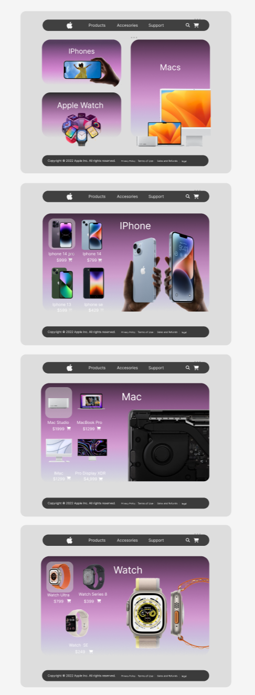
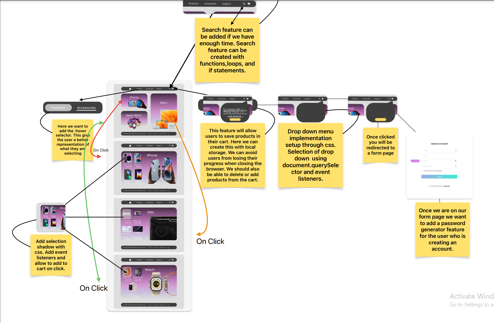

# AppleRedesign-Website

## Description

Provide a short description explaining the what, why, and how of your project. Use the following questions as a guide:

- What was your motivation? This project was exciting becuase it tested my mockup capabilities. I wasn't sure If I would get close to the final result. 
- Why did you build this project? I built this project to practice the concepts that I have learned from the bootcamp.
- What problem does it solve? This project has a simplistic interface. It was built this way to allow users to navigate through with ease. 
- What did you learn? The most valuable thing I learned was working with others. We didn'nt try it untill the end, but we merged a feature through a pull request.

    
    
    
   

## License

## Badges

